## Lecture 1: Concept of reservoir management modeling and data preparation
Keywords: `CREST-3.5` `Reservoir` `Modeling` 

<div align="center">
<br>Xinyi Shen, PhD<br>
<br>xinyis@uwm.edu<br>
</div>

### Scope
This section introduces the motivation, concepts, and practical steps for building a 2D reservoir modeling component within the CREST framework.

### Goals
* Understand the concept of reservoir modules
* Learn how to delineate the maximal range of reservoirs
* Generate stage-storage curves and upscaled reservoir masks for CREST

### Step-by-Step

#### 1. Why Do We Need a Reservoir Module?
- Saudi Arabia is heavily regulated by reservoirs
- Reservoir water level is a unique ground truth
   * It is the only source for calibration

<div align="center">

</div>

#### 2. Assumptions and Conceptual Overview
- Gates are bottom-opening
- Controllable outflow: gates/holes
- Uncontrollable outflow: spillways

<div align="center">
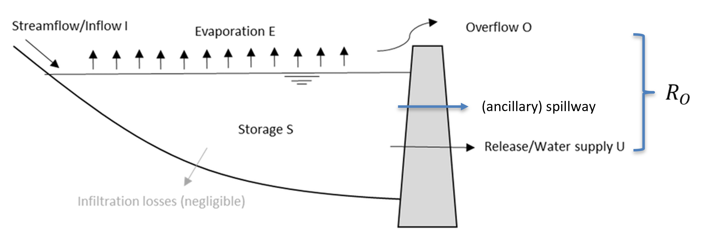
</div>

- Reserevoir Water Balance
   * In theory
   <div align="left">
   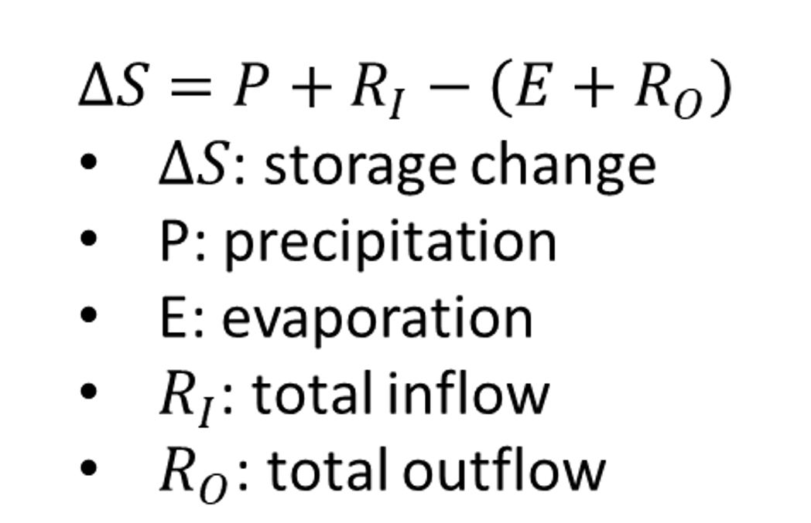
   </div>

   * in model
     - P has been accounted for in the runoff generation
   <div align="left">
   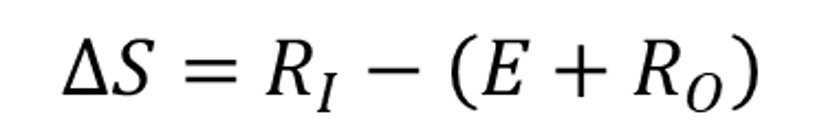
   </div>

- R0 (outflow) computation
   <div align="left">
   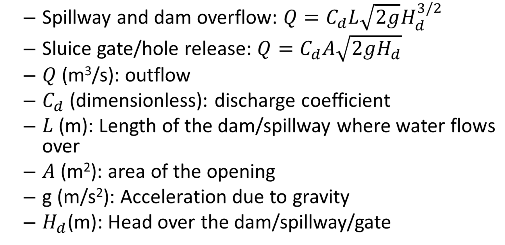
   </div>
  
- Intrinsic logic of reservoir management computation

<div align="center">
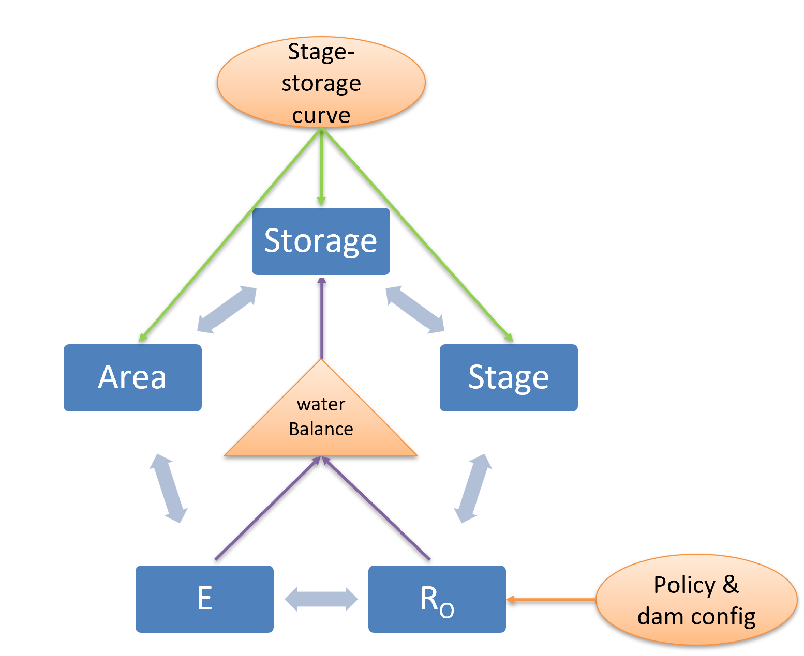
</div>

#### 3. Reservoir Reconstruction
- Goals
  - Find the reservoir maximal range
  - Reconstruct the stage-storage curve
  
- Data
  - Moderate to-fine resolution hydrography | e.g., MERIT v1
  - Fine resolution DTM
- Scenarios
  - Knows dam height but elevation (current)
  - Known the dam height and elevation (to be updated)
  
- Steps

<div align="center">
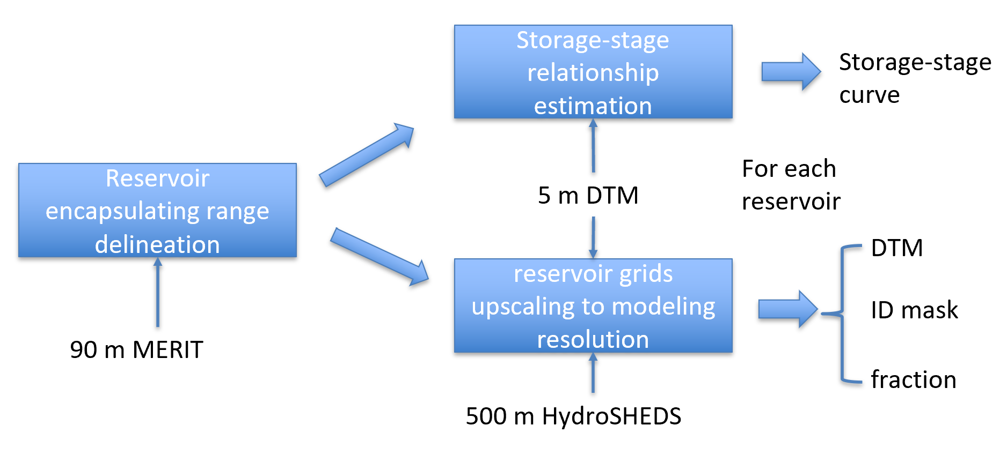
</div>

- Usage
  - DTM: under a given stage, whether a reservoir grid is inundated
  - ID mask: associate the runoff of a reservoir grid to its dam
  - fraction: reservoir evaporation

- Reservoir maximal range delineation
  - Delineate the subbasin upstream to the dam on 90 m MERIT hydrography
     - a. snap the dam location to the correct streamline
     - b. run the watershed algorithm to delineate the upstream
  - Draw a polygon to remove the downstream area within the upstream extent generated in step Subtract the polygon to form a more accurate upstream region
  - Select a seeding (lowest) pixel within the reservoir and close to the dam
  - Full the reservoir then collect pixels that morphologically connected to the seed

  <div align="center">
  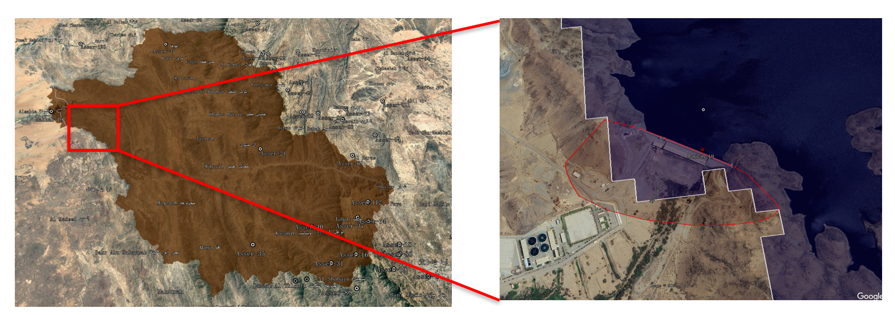
  </div>

  - The reference elevation of the dam height has influence on the maximal range and storage
  - Initially guess the reference elevation using the next grid downstream to the dam
    - connected to the seeding pixels and the upstream subbasin at a given stage
   - be upstream to the dam (using MERIT v1 at 90 m)

  <div align="center">
  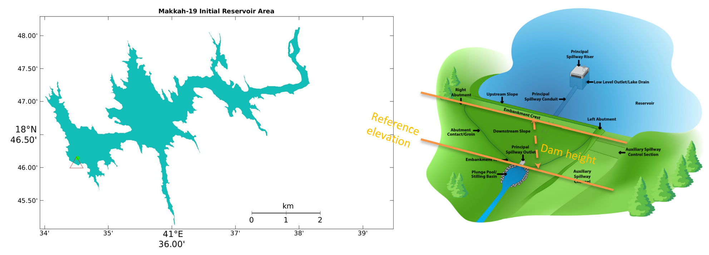
  </div>

  - Calibrate the reference elevation
    - In the second step (reservoir maximal range estimation), a calibration process is needed if we only know the dam height (not elevation)
      ```
      dam elevation=dam height + reference elevation
      ```
    - Scenario 1 Reference elevation and dam elevation are unknown

  - By matching the reconstructed storage capacity with the NCM records, we can adjust the reference elevation
    - Overestimated → reduce the elevation of the seed points; 
    - Underestimated → increase the elevation
  - Computational steps
    - Quick tune using a large elevation step (2m)
    - Fine tune using a small step (0.2m)

   <div align="center">
   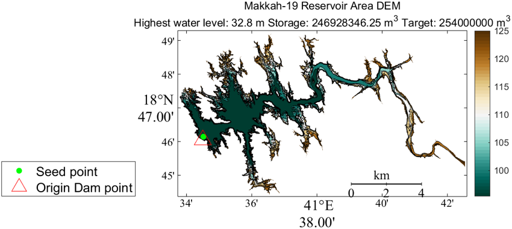
   </div>


#### 4. Stage-storage curve & Reservoir masks generation
- Gradually increase the water level from the lowest reservoir pixel to the dam elevation and estimate the storage, stage, and area at each water level
   <div align="center">
   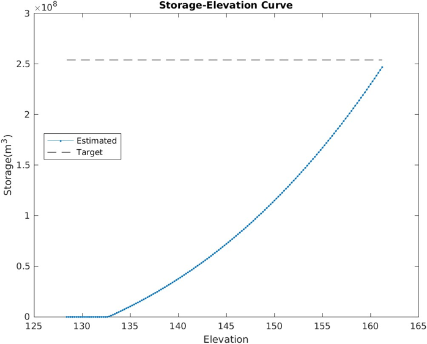
   </div>

- Within the maximal range of each reservoir, we can crop three masks at 5 m, including:
  1. Reservoir DEM (GeoTiff)
  2. Reservoir Mask (GeoTiff) | Set Nodata value as 0
  3. Reservoir ID Mask (GeoTiff)
   <div align="center">
   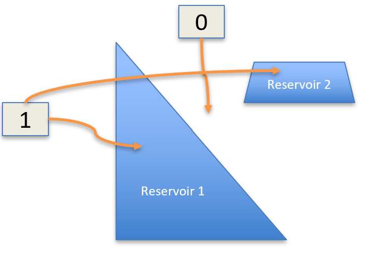
   </div>
  - a. Mosaic the 5 m reservoir masks
  - b. Upscale to 500 m hydrological grids
  - For 1 and 3, we can set nodata value as -9999
  - For 2, we need to set nodata value to 0

#### 6. Dam location correction
  - At 500 m resolution, multiple dams can be located at the same grid, which has to be corrected.
  - Upscaled reservoir maps
   <div align="center">
   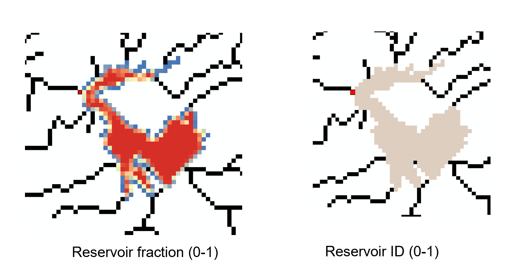
   </div>


#### 6. Hands on
  - Virtually mosaic the 5 m DTM
  - Run the maximal range delineation algorithm
  - Delineate 5 m reservoir mask, reservoir ID, and reservoir DEM using the maximal range
  - Upscale them to 500 m within CREST
