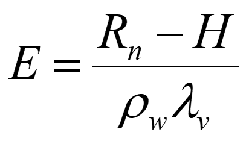

## Lecture 2: The implementation of the reservoir management module built-in CREST
### Part 1 Rainfall-runoff generation
Keywords: `CREST-3.5` `Reservoir` `Modeling` 

<div align="center">
<br>Xinyi Shen, PhD<br>
<br>xinyis@uwm.edu<br>
</div>

### Scope
This section details the simulation of rainfall-runoff in CREST grids that are influenced by reservoirs, and describes the partitioned ET computation.

### Goals
* Simulate rainfall-runoff and partitioned ET in mixed land-reservoir grids
* Understand Penman-based ET and corrections
* Configure and run CREST with reservoir inputs

### Step-by-Step

#### 1. Model Structure (CREST 3.0 → 3.5)
- CREST-3.0 Model Structure
  - It is easier to use an incremental approach to understand the reservoir module
   <div align="center">
   
   </div>

- CREST-3.5 Model Structure Updates
  - For a grid that potentially that reservoir takes up f fraction (0<f<1) 
   <div align="center">
   
   </div> 
    - Reservoir fraction f can be read from the reservoir_fraction mask
    - The inundated status will be determined in the routing process
     - Reservoir DEM and the current stage will be used to evaluate if a reservoir grid is inundated

#### 2. Important Variables in the CREST model
  - The computation of E<sub>land
    - Penman-Monteith equation-energy
       <div align="left">
       
       </div> 

  - Conductance is the reciprocal of resistance
    - 𝑟<sub>0 </sub>− Canopy architecture resistance
    - 𝑟<sub>𝑐 </sub>− Soil Water deficit resistance 
    - 𝑟<sub>𝑤 </sub>−Atmospheric resistance

  - Maximal ET rate of overland areas
    - 𝑊<sub>𝑖 </sub>− intercepted water
    - 𝑊<sub>𝑖𝑚 </sub>− maximal interception capacity

    - Evaporation Rate in the Canopy layer
       <div align="left">
       
       </div> 
    
    - Transpiration rate on the ground
       <div align="left">
       
       </div> 

    - Evaporation rate on the ground
       <div align="left">
       
       </div> 

  - ET-Partition-Time Partition Approach
    - Time fraction of exhausting interception 
       <div align="left">
       
       </div> 

    - Time fraction of exhausting surface water with canopy evaporation
       <div align="left">
       
       </div> 

    - Time  fraction  of exhausting  the rest  surface water
       <div align="left">
       
       </div> 

  - AET rate
       <div align="left">
       
       </div> 

  - The computation of E<sub>lake 
    - Setting  canopy and soil resistance to 0, we have the Penman-Monteith equation recede to  Penman Equation
       <div align="left">
       
       </div>   
    - Penman Equation combines the energy balance and turbulence approaches and is the most widely used equation of Potential Evapotranspiration
    
  - Saturated Vapor Pressure solely depends on temperature
    - Saturated Vapor Pressure
       <div align="left">
       
       </div>    
    - An analytical approximation 
      - e is in (KPa)
      - T is in oC
       <div align="left">
       
       </div>   
    - Actual Vapor Pressure & Relative Humidity
       <div align="left">
       
       </div>  

  - Physics of Evaporation
    - Friction caused by surface roughness reduces V near the ground and produces turbulent eddies
    - The vertical components of the eddies provide the means for exchange of momentum, sensible heat and water vapor between the land surface and atmosphere
       <div align="left">
       
       </div>   

  - The Momentum Approach
    - Recall the mass-transfer equation
      - Latent Heat
        <div align="left">
        
        </div>   
        - K<sub>E is only weather related

          <div align="left">
          
          </div>   
          <div align="left">
          
          </div>   
        - aerodynamic resistance (red rectangle)
          <div align="left">
          
          </div>   

      - Assume weather is known, what is the only unknown to compute ET?
  
  - Sensible Heat
      <div align="left">
      
      </div>  

  - Bowen Ratio
      <div align="left">
      
      </div>  

  - ET Computation-The Energy Balance Approach
    - The energy balance for an evapotranspiration body:
      <div align="left">
      
      </div>  

    - In terms of Bowen ratio
      <div align="left">
      
      </div>  
      <div align="left">
      
      </div>  

  - The Combined Approach-Penman Equation (Penman 1948)
    - Penman Equation: Neglect G, Aw and dU/dt
      <div align="left">
      
      </div>     
    - The slope of saturation vapor pressure vs. T curve
      <div align="left">
      
      </div>   
      <div align="left">
      
      </div>     
    - Rewrite sensible heat using latent heat
      <div align="left">
      
      </div>   
    - Rearranging gives the Penman Equation:
       <div align="left">
      
      </div>   
    
      - Advantages?
      - Drawbacks?
  
 - Penman is inaccurate in lakes/reservoirs
    - Main reason
      - Heat storage of lake water is ignored
    - Main conflicts
      - Water depth is unknown before routing
      - It is difficult to model lake EB without knowing the depth first
      - Land surface runs before routing 
      - Calibration requires routing to be one-way coupled with the land surface module
    - Solution-empirical calibration
      - ET<sub>lake</sub>=ET<sub>penman </sub>x exp (-kD) 
      - ET<sub>lake</sub>=ET<sub>penman </sub>x aD<sup>b


#### 3. Interface of CREST v3.5
  <div align="center">
  
  </div>   
    
  - Let’s change the result and forcing directories for your own output
  <div align="center">
  
  </div>   

  - And please also copy the forcing control files to your forcing directory
  
#### 4. Hands on
  - Forecast the Flood event on Jan 6-25
  - Example control files are stored at 
  - /g/model/hydro/hydrowork/CREST_work/dummy_projects/MidWestCoast/Lzq25_New/Time_class
      ```
      run_m1.conf
      run_m1_new.project
      run_m1.sh
      ```

  - Edit the control file
    <div align="left">
    
    </div>   
    - Dam and Reservoir Section
      <div align="left">
      
      </div>   

  - Copy the observation folder to your own directory and modify the control file accordingly 
    <div align="left">
    
    </div>   

  - Modify the forcing folder to your own path
  - Copy the forcing control file to the your path
  - Set the control file accordingly
    <div align="left">
    
    </div>   

  - Do the same for the result folder
    <div align="left">
    
    </div>

  - $ vi run_m1.conf
    <div align="left">
    
    </div> 
  - point to your own control file and request for the correct number of resources
  
  - Do the same for the bash file
    -  $vi run_m1.sh
    -  Point to your own conf file and request the correct cluster and number of resources matching the configuration file
        <div align="left">
        
        </div>      

  - Submit the job
    -  $ sbatch run_m1.sh

  - Check the progress and job status
    -  $squeue – u your_account
    -  The output file is located in the red box after -o
        <div align="left">
        
        </div>    

  - Runs 3 steps in a role
  - Import forcing
  - Land surface simulation
  - Mosaic
    <div align="left">
    
    </div> 


  - Forecast the Flood event on Jan 6-25
    -  Set up the control file focusing on the added reservoir sections
    -  Visualize runoff, and E<sub>lake
       <div align="center">
       
       </div>  

       <div align="center">
       
       </div> 


