## Lecture 3: The implementation of the reservoir management module built-in CREST
### Part 2 Routing
Keywords: `CREST-3.5` `Reservoir` `Modeling` 

<div align="center">
<br>Xinyi Shen, PhD<br>
<br>xinyis@uwm.edu<br>
</div>

### Scope
This section explains how CREST performs routing through reservoirs and how different management scenarios (general vs. emergency) impact flood events.

### Goals
* Understand routing and flow control logic in CREST
* Modify routing paths and control logic
* Compare flood simulations under different plans

### Step-by-Step

#### 1. Reservoir Routing
- Preprocessing-Snap the dam pixel to the stream
  - A. Downstream to the reservoir
  - B. To the most downstream cell in the reservoir if multiple dams are located in the same hydrological grid 
  
  <div align="center">
  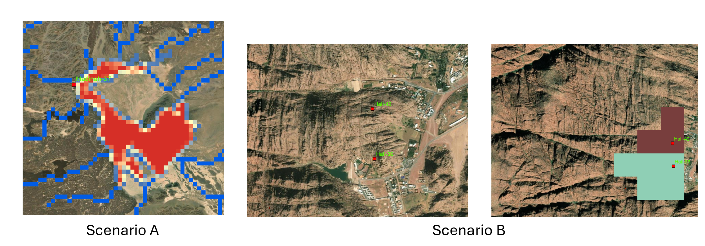
  </div>   

- Modify the routing path
  - Confluence any grid that reaches a reservoir grid to the dam grid
    - We need a reservoir ID mask
  - Intercept any grid that pass over the dam by the dam grid
    - Dam controls the flow

  <div align="center">
  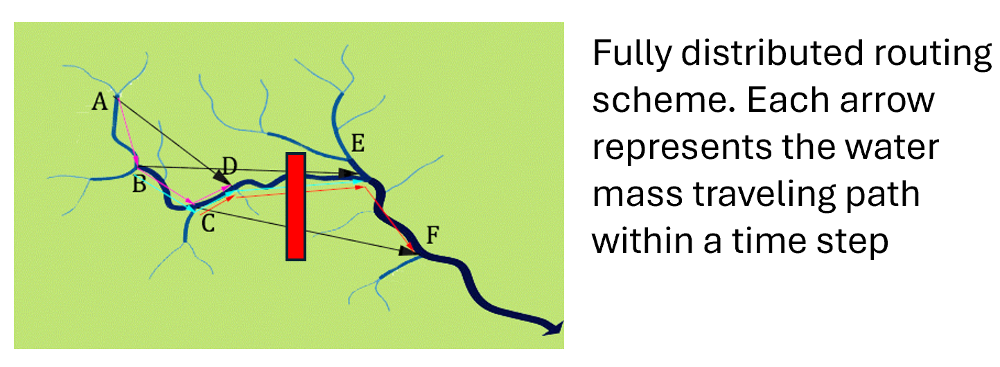
  </div>   

  - Bypass any branch that passes the dam grid without entering the reservoir
    - Makkah 9 and 10 are outlets of parallel subbasins, while on the hydrological grid, Makkah-10 is  upstream to Makkah-9.
    - We need to let the grid of Makkah-10 dam  bypass Makkah-9
  <div align="center">
  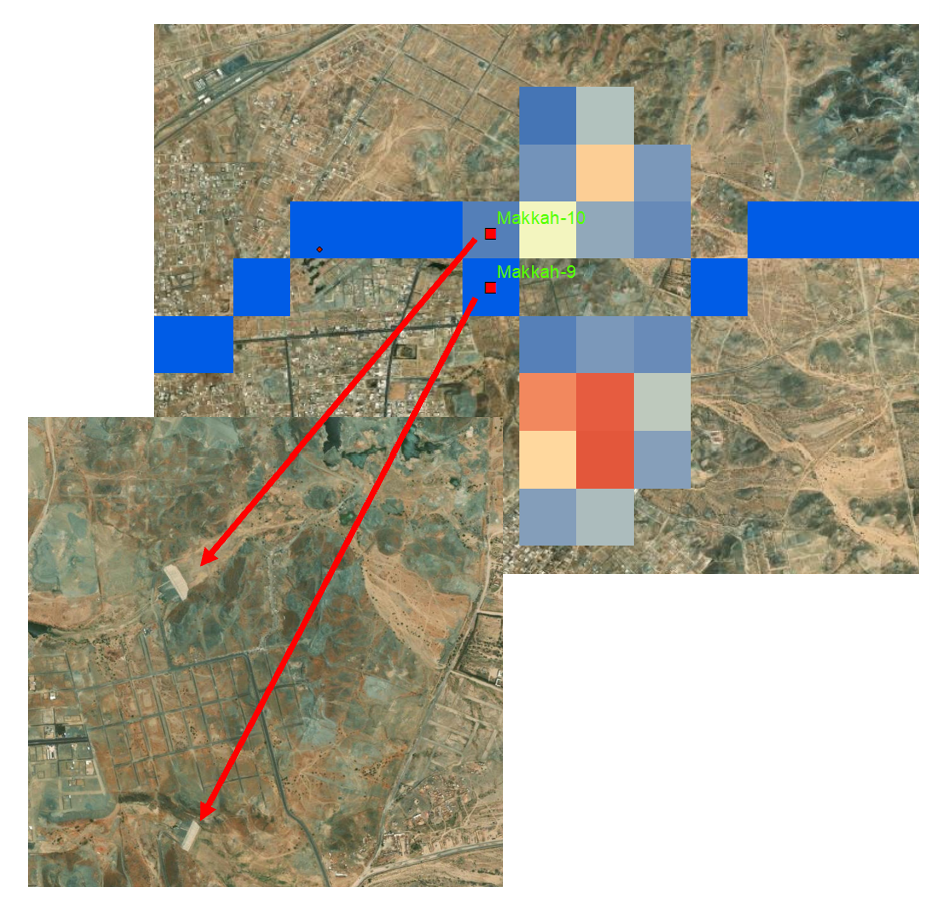
  </div>      


- Water Balance
  <div align="left">
  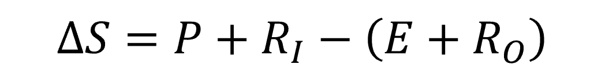
  </div>     

  <div align="center">
  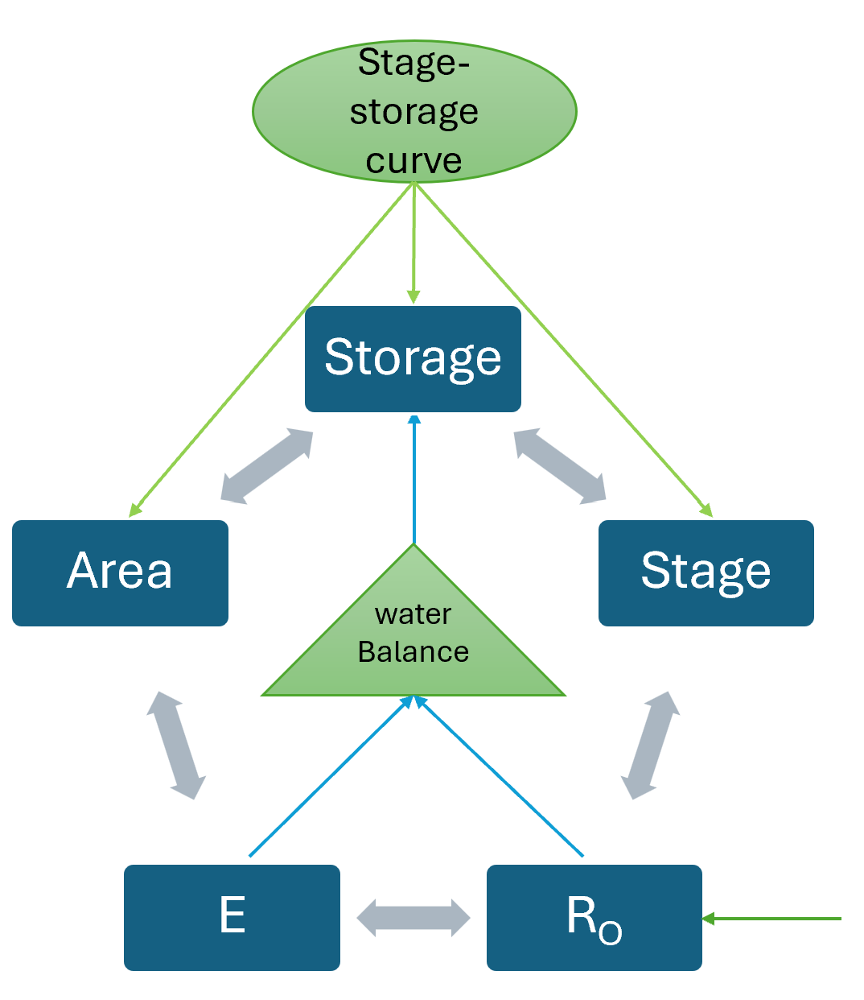
  </div>  

- 𝑅<sub>𝑂 </sub> (outflow) computation
  <div align="center">
  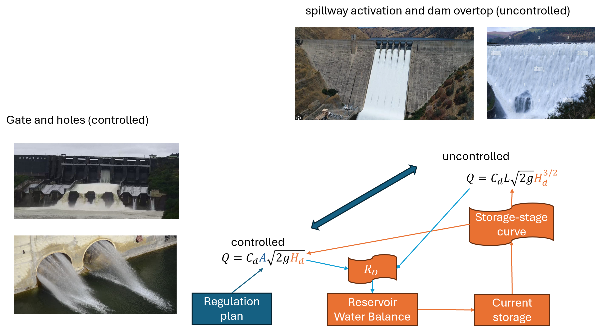
  </div>  

- Regulation plan
  - User defined emergency status
  - Type and status dependent management rules
    - torrent: 5%/hour storage increase
      - 1. Stage 1: 10/15 – 02/15 (4 months)
      - 2. Stage 2: 02/15 – 04/30 (2.5 months)
      - 3. Stage 3: 05/01 – 05/31 (1 month)
      - 4. Stage 4: 06/01 – 10/14 (4.5 months)
  
  <div align="center">
  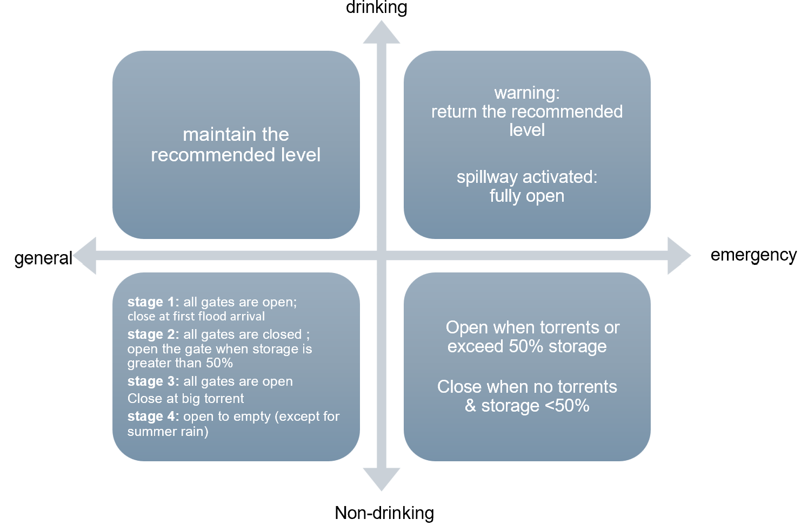
  </div>  

  - For the controlled outflow
    - The gate either fully open or closed
    - The opening time is constrained by the allowed release (e.g., from the current to recommended storage) 
    
#### Hands on: forecast the discharge and reservoir records for 5 flood events 
- Event list

  <div align="center">
  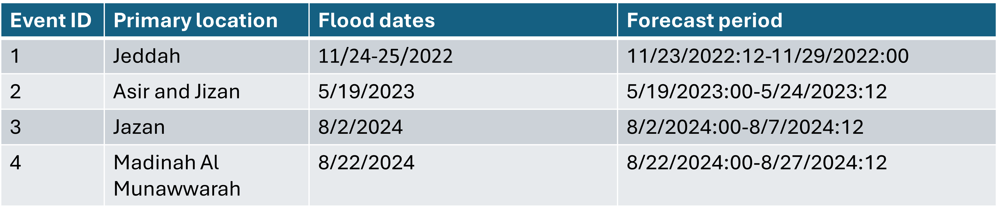
  </div> 

- Interface
  - Project control file
    ```
    /g/model/hydro/hydrowork/CREST_work/dummy_projects/MidWestCoast/Lzq25_New/Time_2022112312UTC/run_m1.project
    ```

      <div align="left">
      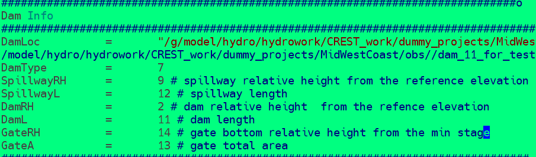
      </div> 

    - Should have been set up in the rainfall-runoff step
      <div align="left">
      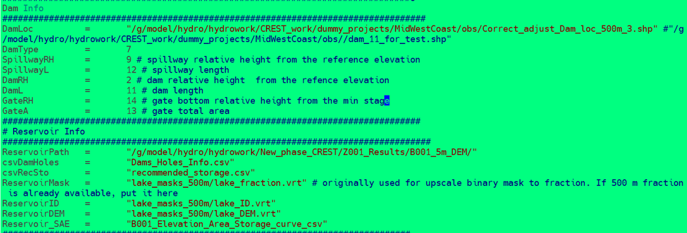
      </div> 

  - A user-defined text file contains all the dams in emergency status
    - The project control file for the general management plan
         <div align="left">
         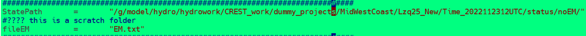
         </div>  
    - The project control file for the emergency management plan
         <div align="left">
         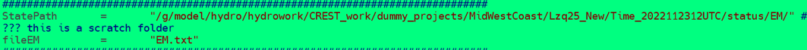
         </div> 
    - For simplicity, all dams are set to emergency or non-emergency in both plans for the hands-on
    
  - Output folder: ResultEx
     <div align="left">
     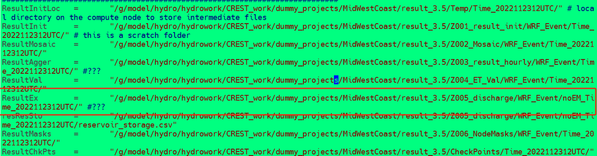
     </div> 

- run the routing
  - We can use interactive mode since it only requires 1 CPU to run the routing
    - An upgrade from single-CPU routing to parallel routing is under construction
         <div align="left">
         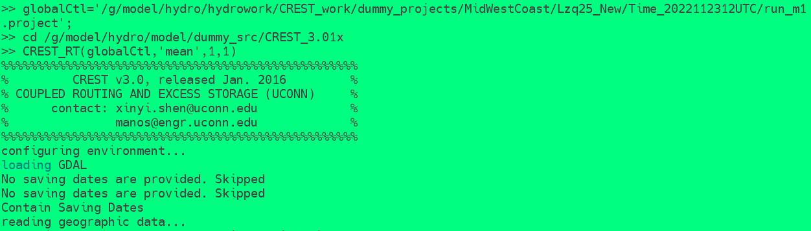
         </div> 

#### Event 1-Jeddah Flood, 11/24-11/25, 2022
- flood downstream
  <div align="left">
  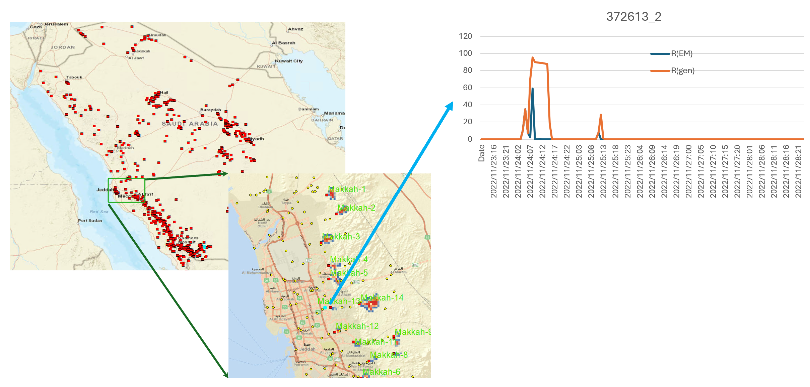
  </div>  

  - Makkah-13 and 14 significantly reduced flood in both plans

- reservoir storage
  - plans
    <div align="left">
    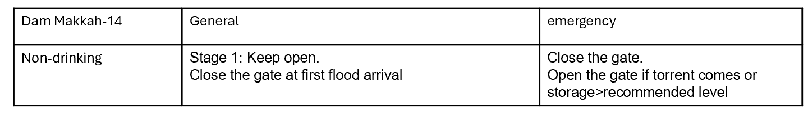
    </div>

    <div align="left">
    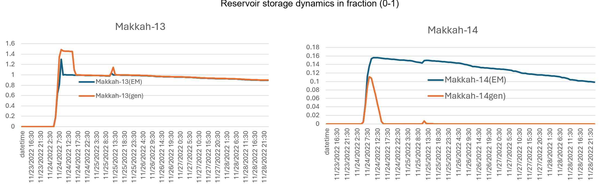
    </div>  

  - General plan: Makkah-14 is kept open until flood (+5%/hour) which was not achieved. The released water overtops Makkah-13, a check dam, it created high flow downstream.
  - Emergency plan: Makkah-14 is kept closed most of the time but was shortly open for 1 hour because a torrent came at 11/24 7:00. It creates much lower flow at the same station.
  
#### Event 2-Asir and Jizan Flood, 5/19, 2023

- discharge
   
  <div align="left">
  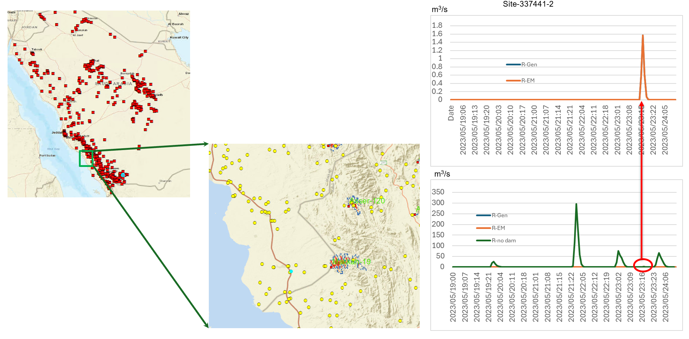
  </div>  
   
   - Makkah-19 neutralized all floods from the upstream, compared with no dam situation.
   
- Reservoir storage and upstream flood
  - plan
    <div align="left">
    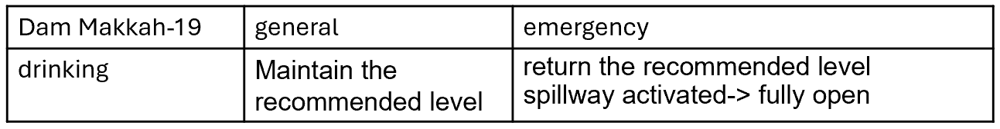
    </div>
    
    <div align="left">
    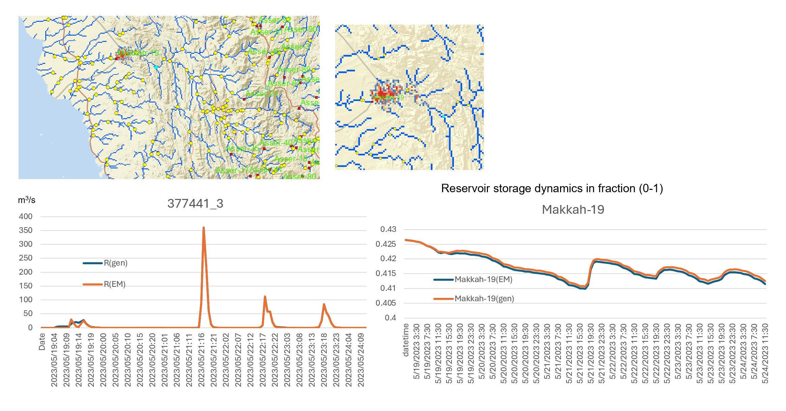
    </div>  

  - Small flow difference in the general and emergency plan at site-377441_3 is caused by the release difference in upstream dams (e.g., Asser 47, 21, 112, etc.)
  
  - No difference between the general and emergency case because the drinking dam Makkah-19 never reached the recommended level

  - Both plans stopped a flood downstream. 3 Flood peaks from site 377441_3 has been neutralized by Makkah-19  


#### Event 3-Jazan Flood, 8/02, 2024
- flood downstream

  - plans
    <div align="left">
    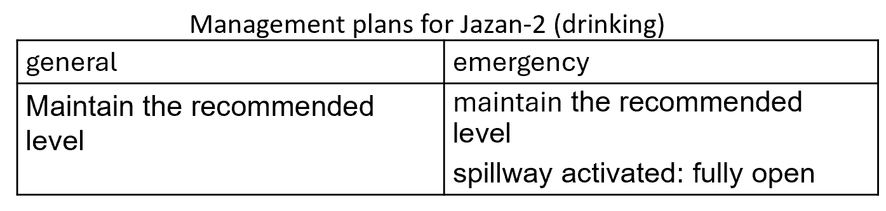
    </div>  

    <div align="left">
    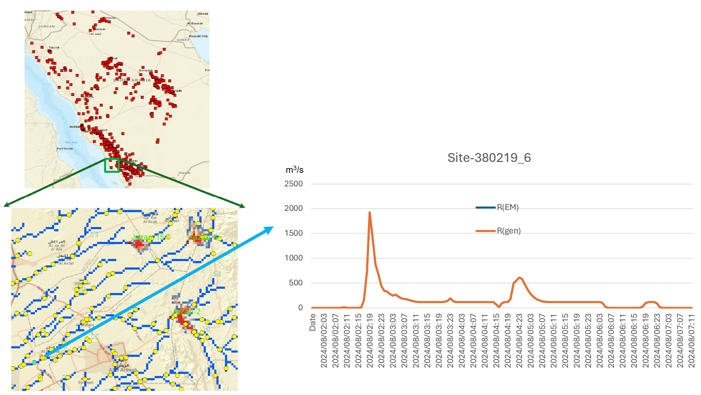
    </div>  

  - The flood at site 380219_6,is reduced significantly by Jazan-2

  - No difference between Emergency and general status. 
  
- reservoir storage
  - plan
    <div align="left">
    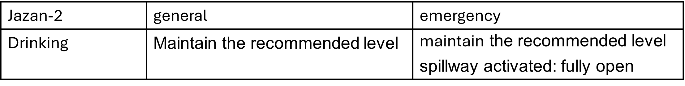
    </div>  

    <div align="left">
    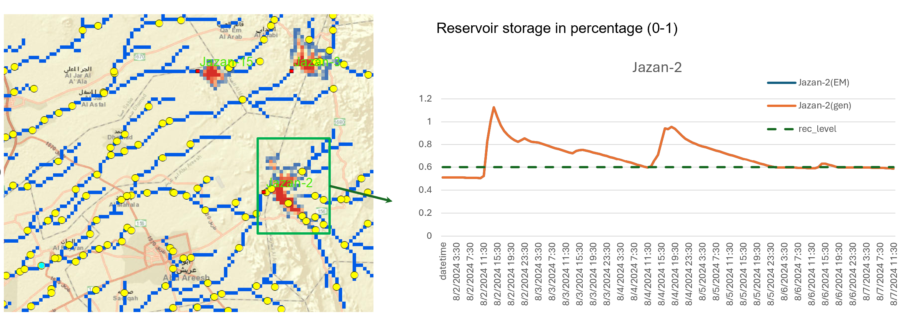
    </div> 

  - No difference between the emergent and general plan because 
    - Jazan-2 was overtopped 
    - The recommended level was reached
    - The spillway was activated for both plans
    
#### Event 4-Madina Al Munawwarah Floods, 8/22, 2024
- Downstream Discharge
  - plan
    <div align="left">
    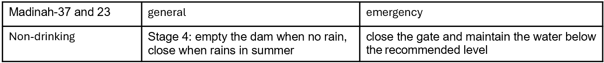
    </div> 

    <div align="left">
    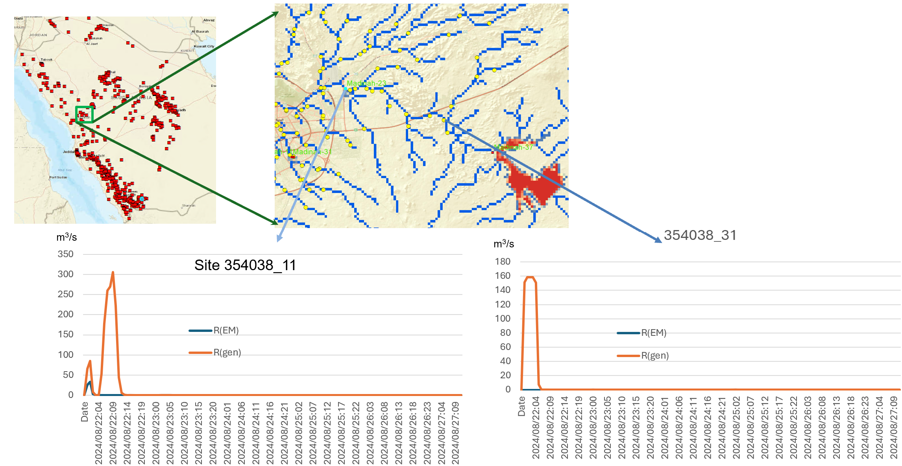
    </div> 

  - General plan: the high flow from Madinah-37 (flow in MR1287) triggered the summer rain condition to close the gates of Madinah-23, which overtops the dam and created a flood in downstream site-354038_11
  - Emergency plan: no water is released from Madinah-37, only evaporation to reduce the storage. Downstream to Madinah-23 only released water to maintain the recommended level
  - No flood if no reservoir release
  

- reservoir storage

  - plan
    <div align="left">
    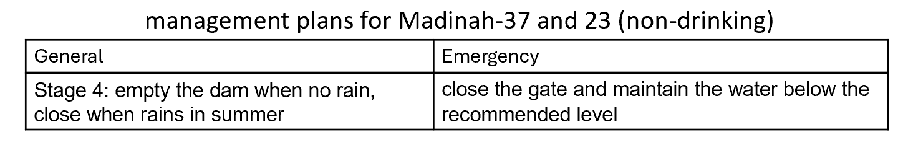
    </div> 

    <div align="left">
    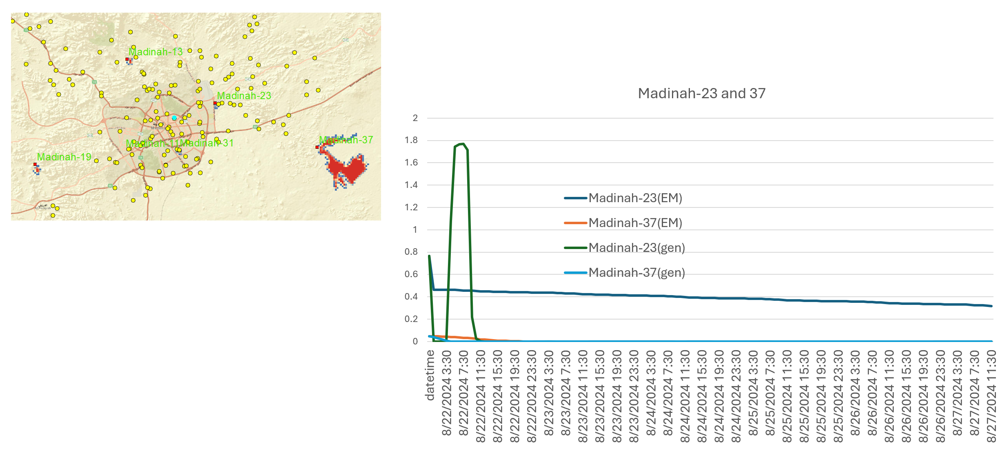
    </div>  

  - General plan: Released water from Madinah-37 overtopped Madinah-23
  - Emergency plan: no water released from Madinah-37; Madinah-23 released water to maintain the recommended level


#### Closing remarks: application of Reservoir management modeling

- Model calibration
    <div align="center">
    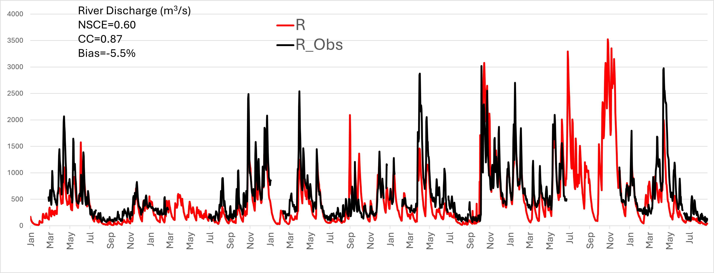
    </div> 


- Predicting impact of cloud seeding
    <div align="center">
    
    </div> 

- Linking to Sediment trapping
    <div align="center">
    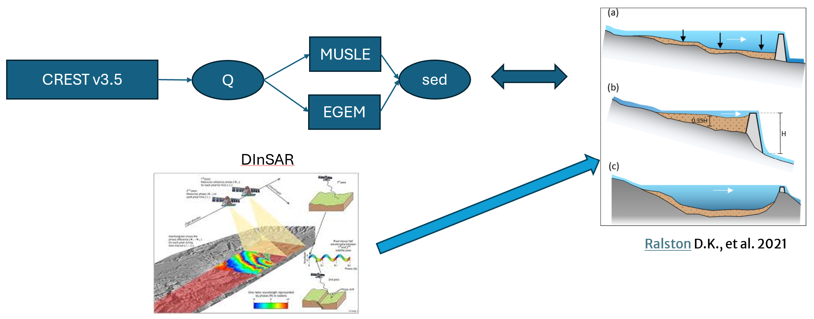
    </div> 

- Harvest flood water
    <div align="center">
    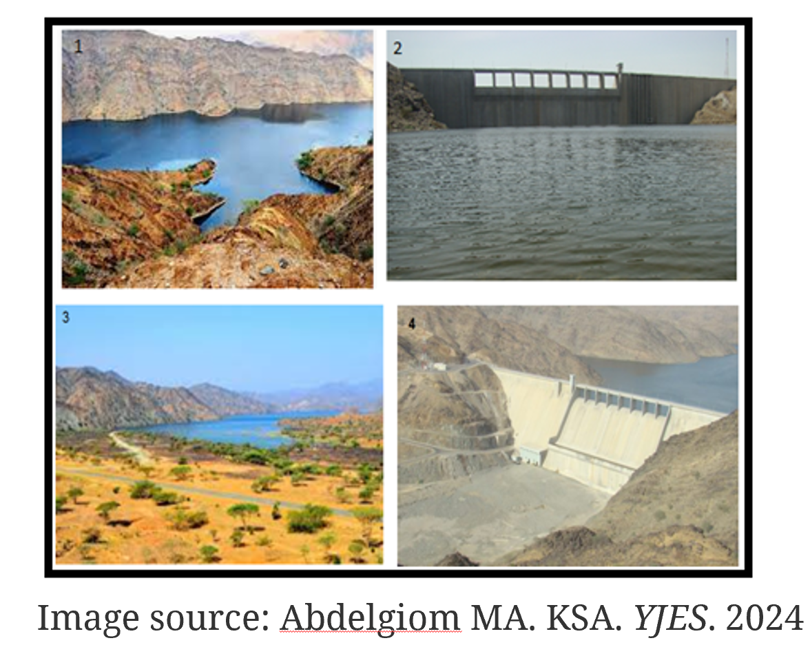
    </div> 

